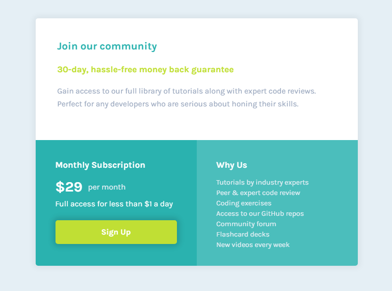

# Frontend Mentor - Single price grid component solution

This is a solution to the [Single price grid component challenge on Frontend Mentor](https://www.frontendmentor.io/challenges/single-price-grid-component-5ce41129d0ff452fec5abbbc).

## Table of contents

- [Overview](#overview)
  - [The challenge](#the-challenge)
  - [Screenshot](#screenshot)
  - [Links](#links)
- [My process](#my-process)
  - [Built with](#built-with)
  - [What I learned](#what-i-learned)
  - [Continued development](#continued-development)
- [Author](#author)

## Overview

### The challenge

Users should be able to:

- View the optimal layout for the component depending on their device's screen size
- See a hover state on desktop for the Sign Up call-to-action

### Screenshot

<center>


<br/>
Desktop design


<br/>
Mobile design

</center>

### Links

- Solution URL: [Here!](https://github.com/mizek1/single-price-grid-component)
- Live Site URL: [Here!](https://mizek1.github.io/single-price-grid-component/)

## My process

### Built with

- Semantic HTML5 markup
- CSS custom properties
- Flexbox
- BEM methodology
- Mobile first

### What I learned

This one was pretty easy too! I added BEM methodology and did mobile layout first.

Some snippets:

> The BEM methodology in HTML:

```html
<div class="section-2">
    <div class="section-2__title">Monthly Subscription</div>
    <div class="section-2__price">
    <span class="section-2__value">&dollar;29</span
    ><span class="section-2__frequency"> per month</span>
    </div>
    <div class="section-2__subtitle">
    Full access for less than &dollar;1 a day
    </div>
    <div class="section-2__sign-up-button">Sign Up</div>
</div>
```

### Continued development

I'm still learning BEM methodology and trying to make my code more clean and reusable!

## Author

- Website - [Danilo Alves](https://github.com/mizek1)
- Frontend Mentor - [@mizek1](https://www.frontendmentor.io/profile/mizek1)
